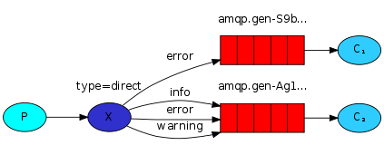

To avoid the rabbitmq server timeing out the consumer for long running tasks, increase ack-timeout
https://www.rabbitmq.com/consumers.html#acknowledgement-timeout
the ack timeout can be set in the configuration file
https://github.com/rabbitmq/rabbitmq-server/blob/main/deps/rabbit/docs/rabbitmq.conf.example

production checklist
https://www.rabbitmq.com/production-checklist.html

# Types of Exchange
## Direct Exchange
- the default exchange with well known name "" is a pre-configured direct exchange
- all queues are by default bound to this default direct exchange unless specified
- sometimes its useful to define custom direct exchanges with more fine grained configurations
### Usecase
- send logs of different serverity to different queues, by using severity as the routing key
- e.g. we can bind "info", "error", "warning" to queue1 consumed by consumer1
and bind "error" to queue2 consumed by consumer2
### Direct Design Pattern
- if a producer wants to publish to a specific queue, it is good practice to have routing key be the same as queue name
- if a producer wants to publish to multiple queues, we can bind multiple queues to the direct exchange with the same routing key

## Fanout Exchange
broadcast messages to all the queues that are bound to the exchange
useful for when you want to notify multiple consumers about a single event
e.g. for logging, where there are multiple log systems for analysis or storage
### Fanout Design Pattern
- declare the exchange, routing key is not used by fanout exchange
- consumer
  - declase the exchange
  - declares the queue
    - with "" queue name, so the queue names are randomly generated
    - with exclusive = true, so the queue is deleted when the consumer is dead
    - bind the queue to the fanout exchange
    - start consuming from that queue
- producer
  - declares the exchange
  - publishes messages to that exchange

## Topic Exchange
- topic exchange allows for more complex routing by allowing wildcards in the routing keys
- the routing keys in topic exchange has to be words delimited by dots .
- `*` matches for exactly one word
- `#` matches for zero or more words
- if wild cards are not used, topic exchange behaves just like direct

# Todo
- [ ] refactor and generalize processors logic
  - how to allow processors with different arguments?
- [ ] test sqlx
- [ ] test aws appconfig
- [ ] add global configuration

# Python Equivalent
https://github.com/pika/pika/blob/main/examples/basic_consumer_threaded.py
